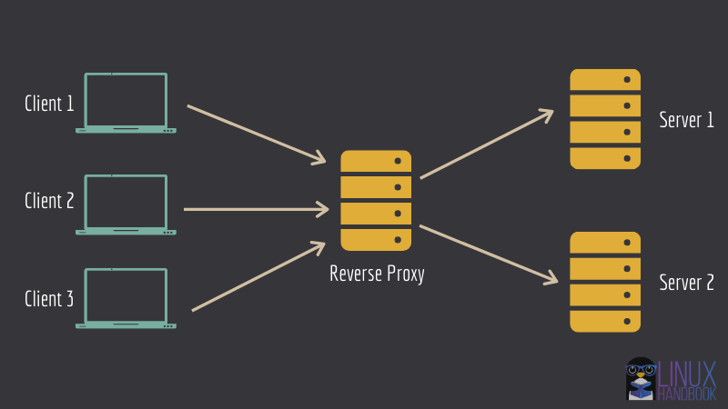

# RESILIENCE AND SCALABILITY OF A SOFTWARE

In these tipic I will show a little about resilience and scalability of a software and create an example using
`Load Balance` and `Nginx` to this activity.

Always that I think about scalability, I think in orizontal scalability that consists in has several replications of
application running in servers, containers and all requisitions or called at application are distributeds to this replics.

But before to continue to talk about it we need to understand what's `Proxy` and `Proxy reverse`.

-  **Proxy**: is a unique point of access of my application to external world, in some cases internet.

An example that we can consider is when your use `VPN` to access the internet and protect your real address while navigate. Other is when you restrict some address for example the access to YT in you internet.

- **Proxy Reverse**: is complecly the reverse of Proxy, is a unique point of access of internet to my private network.

In fact how it run?.

We can imagine that in your company have differents `DNS` for the websites, for example.

    - `https://school.com` -> The main website
    - `https://painel.school.com` -> The backoffice
    - `https://financial.school.com` -> The financial site

Resume, all these sites running in differents points of access and you cannot show to users, in this cases you can use proxy reverse for redirect to address that the user want.

for example, protect the datas of machine.

Simulating an example can being are:

    - My Domains (main)
        - `https://school.com` -> The main website
        - `https://painel.school.com` -> The backoffice
        - `https://financial.school.com` -> The financial site
    
    - Nginx 
        https://school.com/
            -> redirect to `https://school.com`
        
        https://school.com/painel
            -> redirect to `https://painel.school.com`
        
        https://school.com/financial
            -> redirect to `https://financial.school.com`

If you verify when we use Nginx that is a good tools and more famous to work with proxy reverse we have only one address and this address redirect to differents DNS depending of requisition.

I think that you understand 🙂.

Basicly the redirect is make across host.

### Then What's Nginx.

Is a open source tools writed in C and can to be used as web server or proxy reverse and morethings.

Is the most popular tools used to proxy reverse too.

Bellow you can find an example of what we will do:

## Required tools

- [Nginx](https://www.nginx.com/)
- [Docker & Docker-Compose](https://www.docker.com/)
